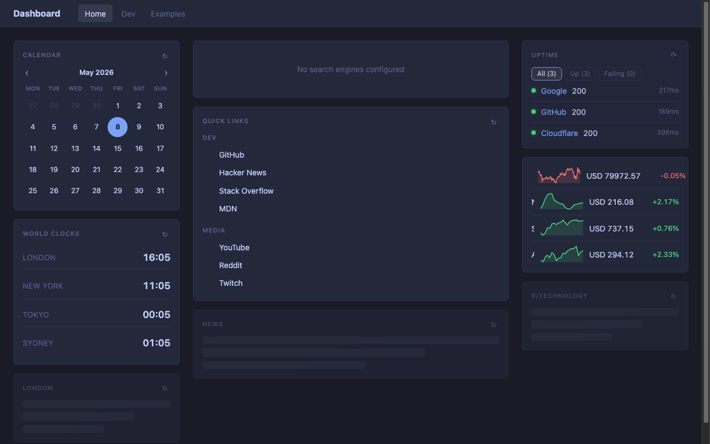

<p align="center">
  
</p>

# Hyper Dashboard

A self-hosted personal dashboard built with **Dart + Shelf + HTMX**. Inspired by [glanceapp/glance](https://github.com/glanceapp/glance), it aggregates information from multiple services into a single configurable page — no JavaScript framework required.

<p align="center">
  
</p>

## Features

- **YAML configuration** — single file drives everything: pages, columns, widgets, and theme
- **22 widgets** — news feeds, weather, markets, Docker containers, uptime monitoring, media, and more
- **Multi-page layout** — tab navigation between pages with HTMX (no full reloads)
- **Stale-while-revalidate caching** — serve cached data instantly, refresh in background
- **Async rendering** — widgets load independently; slow sources don't block the page
- **Built-in media player** — floating YouTube/audio player with queue support
- **Theming** — fully customisable colours, font, and border radius via CSS variables

## Quick Start

**Prerequisites:** [Dart SDK](https://dart.dev/get-dart) 3.0 or newer.

```bash
# Clone and fetch dependencies
git clone <repo-url> hyper-dashboard
cd hyper-dashboard
dart pub get

# Copy and edit the example config
cp config/demo.yaml config/hyper-dashboard.yaml   # or edit the existing one

# Run
dart run bin/hyper_dashboard.dart
```

Open [http://localhost:8080](http://localhost:8080) in your browser.

## Docker

Pre-built images for `linux/amd64` and `linux/arm64` are published to the GitHub Container Registry:

```bash
docker run -d \
  -p 8080:8080 \
  -v "$PWD/config:/usr/local/bin/config:ro" \
  ghcr.io/luissantos/hyper-dashboard
```

### Build Locally

```bash
docker build -t hyper-dashboard .
docker run -d \
  -p 8080:8080 \
  -v "$PWD/config:/usr/local/bin/config:ro" \
  hyper-dashboard
```

### Docker Compose

```yaml
services:
  dashboard:
    image: ghcr.io/luissantos/hyper-dashboard
    ports:
      - "8080:8080"
    volumes:
      - ./config:/usr/local/bin/config:ro
    restart: unless-stopped
```

If using the Docker widget, mount the Docker socket:

```yaml
    volumes:
      - ./config:/usr/local/bin/config:ro
      - /var/run/docker.sock:/var/run/docker.sock:ro
```

## Configuration

All configuration lives in `config/hyper-dashboard.yaml`. The top level has two keys:

```yaml
theme:
  background: "#141414"
  surface:    "#1e1e1e"
  border:     "#2a2a2a"
  text:       "#e0e0e0"
  text-muted: "#808080"
  accent:     "#c084fc"
  font:       "Inter, system-ui, sans-serif"
  radius:     "6px"

pages:
  - name: Home
    columns:
      - size: small          # 'small' (~300 px) or 'full' (flex-grow)
        widgets:
          - type: calendar
          - type: weather
            location: London, UK
            units: metric
```

See [docs/building.md](docs/building.md) for CLI flags and Docker usage.

## Widgets

| Widget | Type | Description |
|--------|------|-------------|
| [Clock](docs/widgets.md#clock) | `clock` | Live clock, single timezone or world-clock list |
| [Calendar](docs/widgets.md#calendar) | `calendar` | Monthly calendar with HTMX navigation |
| [Weather](docs/widgets.md#weather) | `weather` | Current conditions + 7-day forecast (Open-Meteo) |
| [RSS](docs/widgets.md#rss) | `rss` | Aggregate multiple RSS/Atom feeds |
| [Hacker News](docs/widgets.md#hacker-news) | `hacker-news` | Top stories from Hacker News |
| [Lobsters](docs/widgets.md#lobsters) | `lobsters` | Hot or newest stories from Lobsters |
| [Reddit](docs/widgets.md#reddit) | `reddit` | Posts from any subreddit |
| [Videos](docs/widgets.md#videos) | `videos` | Latest videos from YouTube channels |
| [Bookmarks](docs/widgets.md#bookmarks) | `bookmarks` | Grouped links with Simple Icons |
| [Search](docs/widgets.md#search) | `search` | Search box with bang shortcuts |
| [Monitor](docs/widgets.md#monitor) | `monitor` | HTTP uptime monitor |
| [Markets](docs/widgets.md#markets) | `markets` | Stock and crypto prices with sparklines |
| [Releases](docs/widgets.md#releases) | `releases` | Latest releases from GitHub/GitLab/Codeberg/Docker Hub |
| [Repository](docs/widgets.md#repository) | `repository` | GitHub repo stats, open PRs, issues, and commits |
| [Audiobookshelf](docs/widgets.md#audiobookshelf) | `audiobookshelf` | In-progress books/podcasts from Audiobookshelf |
| [Docker](docs/widgets.md#docker) | `docker` | Container list with start/stop/restart and log viewer |
| [Twitch Channels](docs/widgets.md#twitch-channels) | `twitch-channels` | Live status for followed Twitch channels |
| [Twitch Top Games](docs/widgets.md#twitch-top-games) | `twitch-top-games` | Currently trending games on Twitch |
| [HTML](docs/widgets.md#html) | `html` | Raw HTML content block |
| [iFrame](docs/widgets.md#iframe) | `iframe` | Embed an external URL |
| [Group](docs/widgets.md#group) | `group` | Tab container for multiple widgets |
| [Split Column](docs/widgets.md#split-column) | `split-column` | Side-by-side multi-column layout |

## Common Widget Options

Every widget supports these options in addition to its own:

| Option | Type | Default | Description |
|--------|------|---------|-------------|
| `title` | string | widget default | Override the widget header title |
| `hide-header` | bool | `false` | Hide the header bar entirely |
| `cache` | duration | `15m` | How long to cache fetched data. Formats: `10s`, `5m`, `2h`, `1d` |
| `refresh` | duration | same as `cache` | How often to refresh the widget display. Use `0` to disable auto-refresh. Falls back to `cache` when not set |
| `async-policy` | string | `stale` | `never` — render synchronously; `always` — always show skeleton first; `stale` — serve cached data immediately, refresh in background if stale |

## Layout

Pages contain **columns**. Each column has a `size` and a list of widgets:

```yaml
pages:
  - name: My Page
    columns:
      - size: small   # fixed ~300px sidebar
        widgets: [...]

      - size: full    # flex-grows to fill remaining space
        widgets: [...]

      - size: small
        widgets: [...]
```

Columns are laid out horizontally. Use `small` for sidebars and `full` for the main content area.

## Tech Stack

- **Dart 3** with [Shelf](https://pub.dev/packages/shelf) HTTP server
- **HTMX 2.0** for partial updates (no full-page reloads)
- **Alpine.js 3.15** for reactive client-side state (media player)
- **YAML** configuration parsed with [yaml](https://pub.dev/packages/yaml)
- No build step, no bundler — just `dart run`
