# Configuration

This directory contains demo configuration files for Hyper Dashboard.

## Usage

```bash
dart run bin/hyper_dashboard.dart --config config/demo.yaml
```

Or use a specific theme:

```bash
dart run bin/hyper_dashboard.dart --config config/themes/tokyo-night.yaml
```

## Themes

The `themes/` directory includes 14 pre-built themes:

- Catppuccin Mocha
- Dracula
- Everforest Dark
- Gruvbox Dark
- Light
- Monokai
- Nord (and variants: Aurora, Frost, Light)
- One Dark
- Rose Pine
- Solarized Dark
- Tokyo Night

Each theme file is a complete `hyper-dashboard.yaml` config with theme colors and example widgets.

## Screenshots

Screenshots in `screenshots/` show Hyper Dashboard rendered with each theme:

| Theme | Screenshot |
|-------|-----------|
| Catppuccin Mocha | 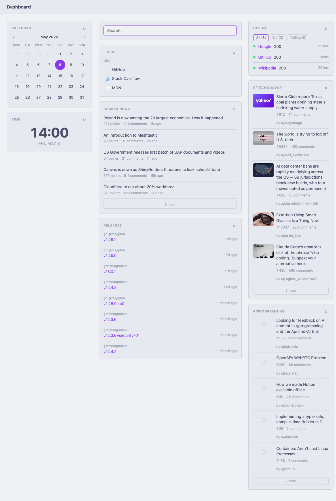 |
| Dracula | 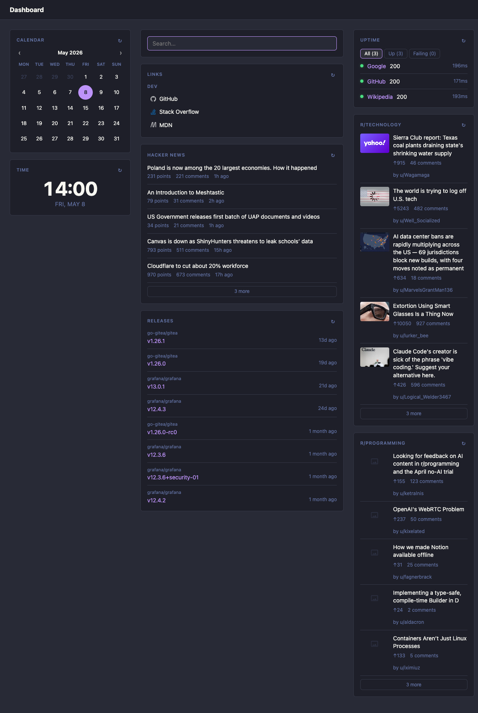 |
| Everforest Dark | 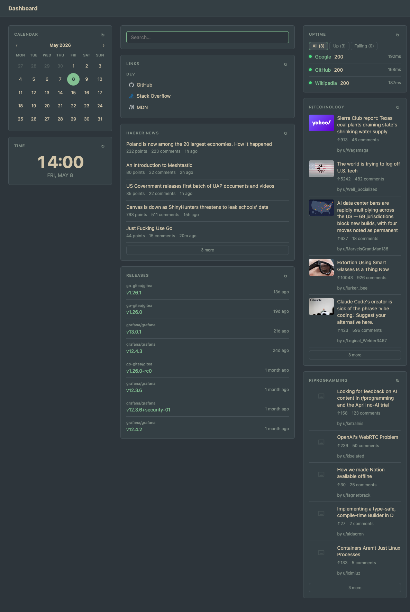 |
| Gruvbox Dark | 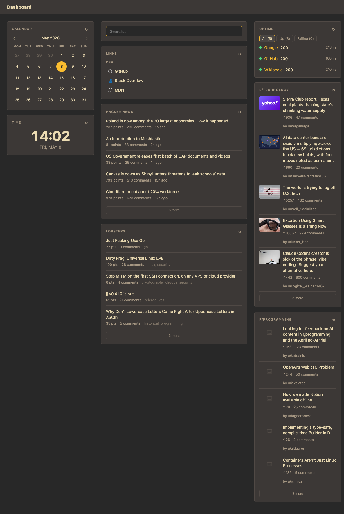 |
| Light | 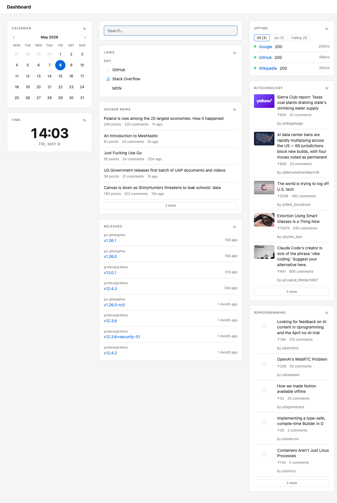 |
| Monokai | 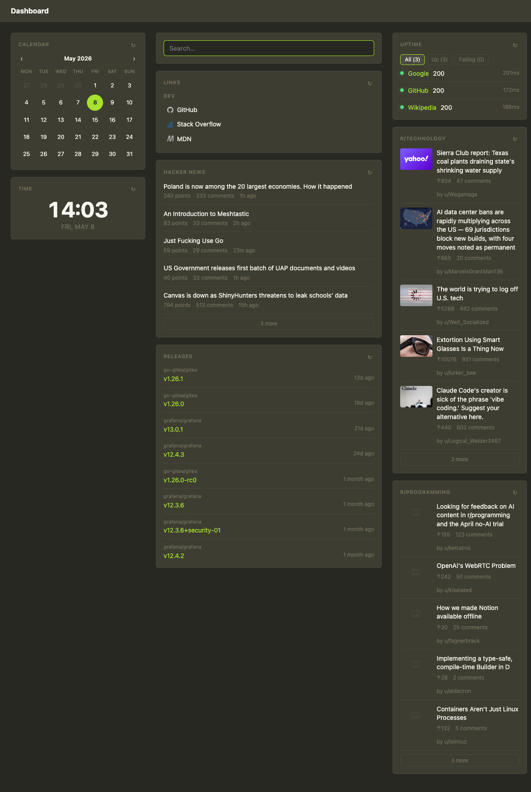 |
| Nord | 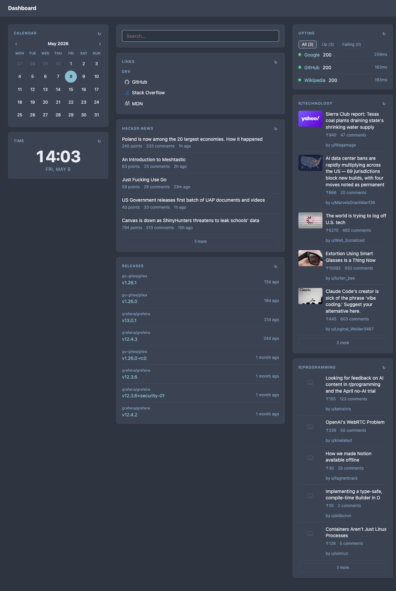 |
| Nord Aurora | 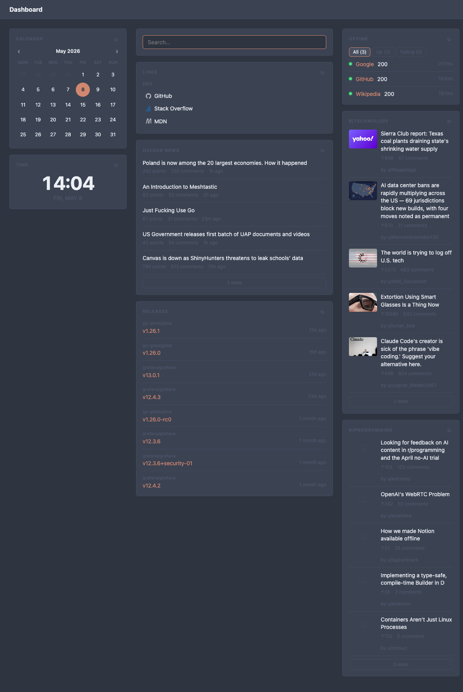 |
| Nord Frost | 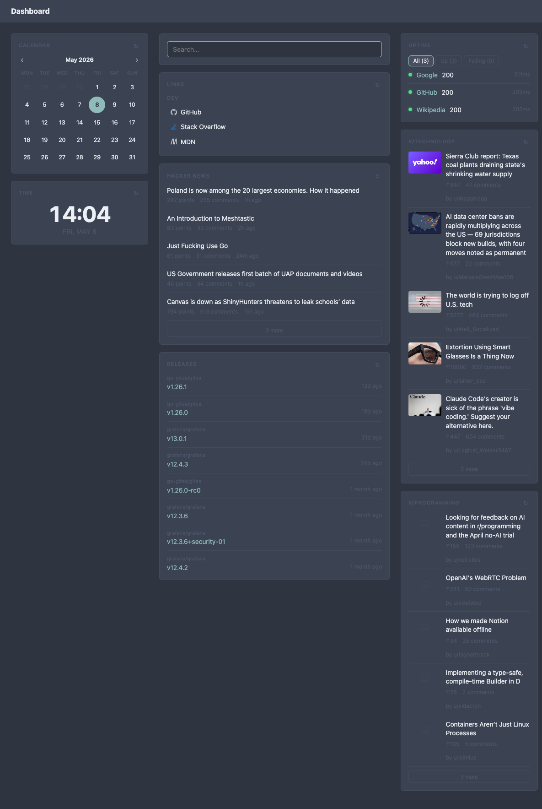 |
| Nord Light | 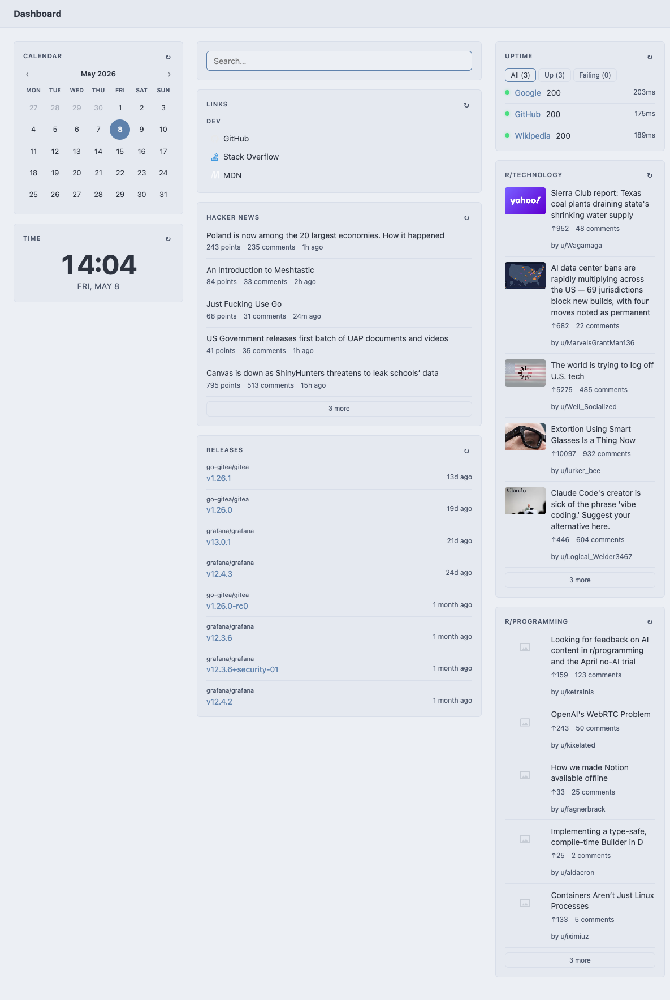 |
| One Dark | 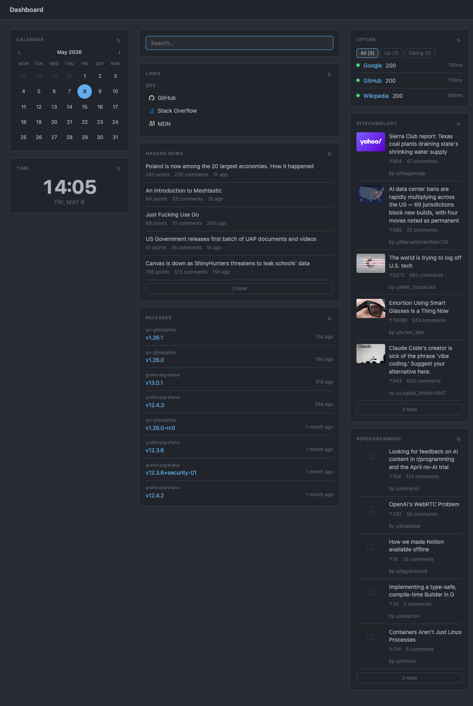 |
| Rose Pine | 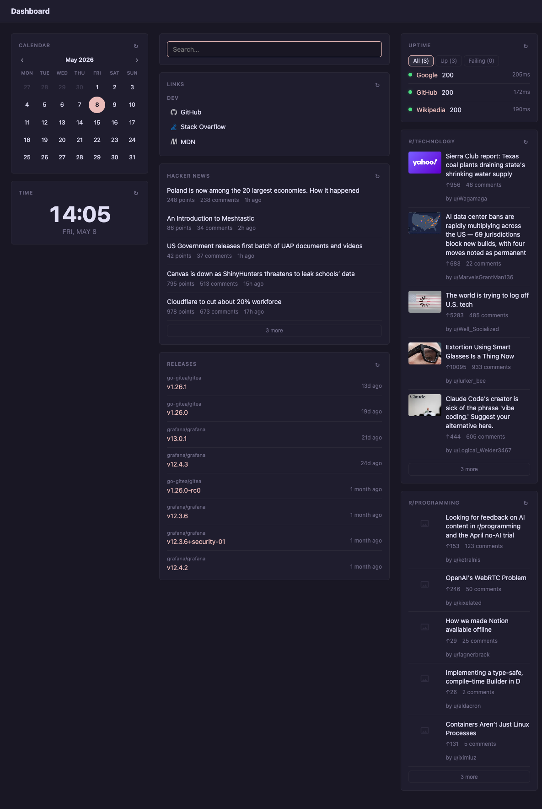 |
| Solarized Dark | 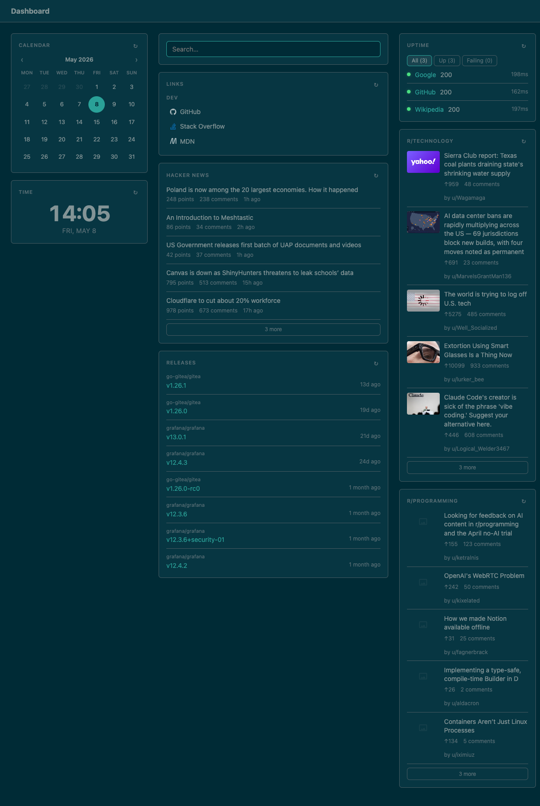 |
| Tokyo Night | 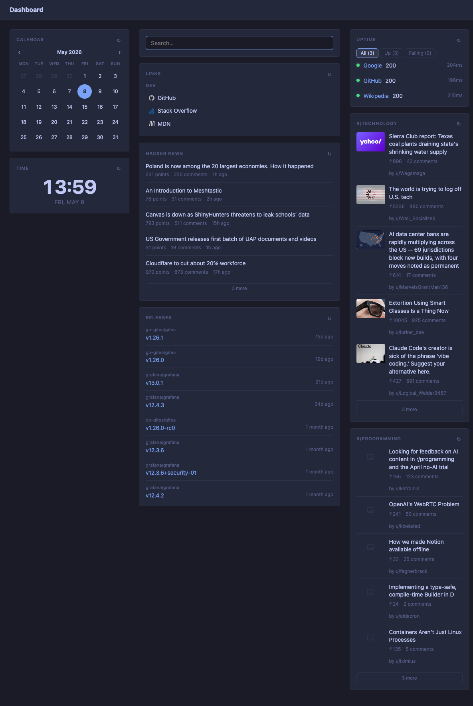 |
