# Widgets Reference

All available widgets and their configuration options.

**Common options** available on every widget:

| Option | Type | Default | Description |
|--------|------|---------|-------------|
| `title` | string | widget default | Override the widget header title |
| `hide-header` | bool | `false` | Hide the header bar entirely |
| `cache` | duration | `15m` | How long to cache fetched data. Formats: `10s`, `5m`, `2h`, `1d` |
| `refresh` | duration | same as `cache` | How often to refresh the widget display. Use `0` to disable auto-refresh. Falls back to `cache` when not set |
| `async-policy` | string | `stale` | `never` — render synchronously; `always` — always show loading skeleton first; `stale` — serve cached data immediately, refresh in background if stale |

---

## Table of Contents

- [Calendar](#calendar)
- [Clock](#clock)
- [Weather](#weather)
- [RSS](#rss)
- [Hacker News](#hacker-news)
- [Lobsters](#lobsters)
- [Reddit](#reddit)
- [Videos](#videos)
- [Bookmarks](#bookmarks)
- [Search](#search)
- [Monitor](#monitor)
- [Markets](#markets)
- [Releases](#releases)
- [Repository](#repository)
- [Audiobookshelf](#audiobookshelf)
- [API](#api)
- [Docker](#docker)
- [Twitch Channels](#twitch-channels)
- [Twitch Top Games](#twitch-top-games)
- [HTML](#html)
- [iFrame](#iframe)
- [Group](#group)
- [Split Column](#split-column)

---

## Calendar

**Type:** `calendar`

Displays a monthly calendar grid for the current month. Previous and next month navigation is handled with HTMX (no page reload). Today's date is highlighted.

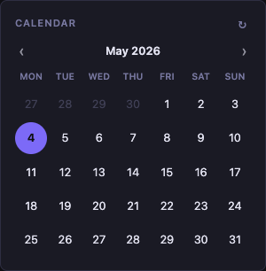 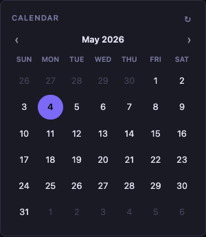

### Example

```yaml
- type: calendar
  first-day-of-week: monday
```

### Options

| Option | Type | Default | Description |
|--------|------|---------|-------------|
| `first-day-of-week` | string | `monday` | First day of the week. Accepts `monday` or `sunday` |

### Notes

- Days from the previous and next months are shown as filler cells with reduced opacity.
- Navigation arrows load the adjacent month inline via HTMX.
- The `cache` and `async-policy` options have no effect since the calendar reads the current date from the server clock.

---

## Clock

**Type:** `clock`

Displays a live clock. Supports a single timezone or a world-clock list with multiple labelled entries. The time ticks every second in the browser using `toLocaleTimeString`.

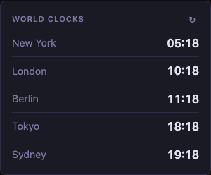 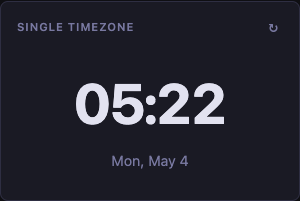

### Single Timezone

```yaml
- type: clock
  title: Local Time
  timezone: Europe/Lisbon
```

| Option | Type | Default | Description |
|--------|------|---------|-------------|
| `timezone` | string | `UTC` | IANA timezone identifier (e.g. `Europe/London`, `America/New_York`) |

### World Clock List

When `timezones` is provided, the single-clock layout is replaced by a labelled list.

```yaml
- type: clock
  title: World Clocks
  timezones:
    - label: Lisbon
      timezone: Europe/Lisbon
    - label: London
      timezone: Europe/London
    - label: New York
      timezone: America/New_York
    - label: Tokyo
      timezone: Asia/Tokyo
```

| Option | Type | Description |
|--------|------|-------------|
| `timezones` | list | List of `{ label, timezone }` entries |
| `timezones[].label` | string | Display name shown next to the time |
| `timezones[].timezone` | string | IANA timezone identifier |

### Notes

- The clock is rendered server-side with the current time and then kept live via a small inline script — no framework dependency.
- The `cache` and `async-policy` options have no effect on this widget since it reads the current system time.
- Valid timezone identifiers are listed in the [IANA Time Zone Database](https://www.iana.org/time-zones).

---

## Weather

**Type:** `weather`

Shows current weather conditions and a 7-day forecast. Clicking a forecast day switches to an hourly breakdown for that day. Data is fetched from [Open-Meteo](https://open-meteo.com/) — no API key required.

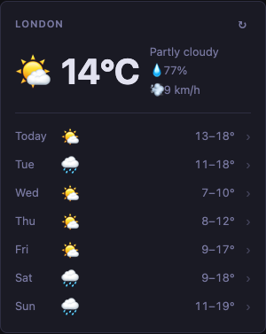 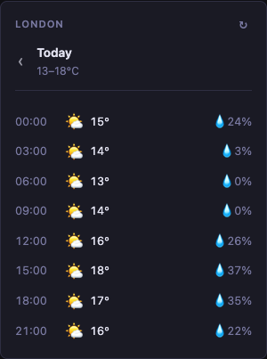

### Example

```yaml
- type: weather
  title: London
  location: London
  units: metric
  cache: 30m
  async-policy: stale
```

### Options

| Option | Type | Default | Description |
|--------|------|---------|-------------|
| `location` | string | `London` | Location name used for geocoding (e.g. `"Tokyo"`, `"New York"`) |
| `units` | string | `metric` | Unit system. `metric` (°C, km/h) or `imperial` (°F, mph) |

### Display

**Daily view** (default):
- Current temperature, weather description, humidity, and wind speed
- 7-day forecast strip — click any day to drill into hourly detail

**Hourly view** (after clicking a day):
- 3-hour interval breakdown showing time, icon, temperature, and precipitation probability
- Back button returns to the daily view

### Notes

- Geocoding results are cached for **7 days** regardless of the widget `cache` setting.
- Forecast data respects the widget `cache` duration.
- Uses the Open-Meteo geocoding and forecast APIs, which are free and require no registration.

---

## RSS

**Type:** `rss`

Aggregates one or more RSS or Atom feeds into a single list, sorted by publication date (newest first).

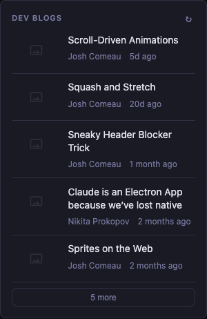

### Example

```yaml
- type: rss
  title: Tech Blogs
  cache: 12h
  limit: 8
  async-policy: stale
  feeds:
    - url: https://selfh.st/rss/
      name: selfh.st
    - url: https://ciechanow.ski/atom.xml
      name: Bartosz Ciechanowski
    - url: https://www.joshwcomeau.com/rss.xml
      name: Josh Comeau
```

### Options

| Option | Type | Default | Description |
|--------|------|---------|-------------|
| `feeds` | list | — | List of feed sources (required) |
| `feeds[].url` | string | — | Full URL of the RSS or Atom feed |
| `feeds[].name` | string | — | Label shown in the item metadata |
| `limit` | int | `15` | Maximum number of items to display |

### Notes

- All feeds are fetched in parallel.
- Items from all feeds are merged and sorted by `pubDate` before the `limit` is applied.
- Feed fetch errors are silently ignored — other feeds still render.
- The widget shows article thumbnails when the feed provides a `<media:thumbnail>` or `<enclosure>` element.

---

## Hacker News

**Type:** `hacker-news`

Shows stories from [Hacker News](https://news.ycombinator.com/). Each item links to the original article; the comment count links to the HN discussion thread.

### Example

```yaml
- type: hacker-news
  title: Hacker News
  mode: top
  limit: 10
  cache: 30m
```

### Options

| Option | Type | Default | Description |
|--------|------|---------|-------------|
| `mode` | string | `top` | Which feed to show — see modes below |
| `limit` | int | `10` | Number of stories to fetch and display |
| `comments-url-template` | string | HN item URL | Override the comments link. Use `{POST-ID}` as the placeholder for the story ID |

### Modes

| Mode | Feed |
|------|------|
| `top` | Top stories (default) |
| `new` | Newest stories |
| `best` | Best stories |
| `ask` | Ask HN stories |
| `show` | Show HN stories |
| `jobs` | Job postings |

### Custom Comments URL

If you run a self-hosted HN mirror or alternative frontend, you can point comments links there:

```yaml
- type: hacker-news
  comments-url-template: "https://hn.your-domain.com/item?id={POST-ID}"
```

### Notes

- Uses the official [Hacker News API](https://github.com/HackerNews/API).
- Story IDs are fetched first, then each item is fetched individually in parallel.
- No API key required.

---

## Lobsters

**Type:** `lobsters`

Shows stories from [Lobste.rs](https://lobste.rs/), a technology-focused link-aggregation community. Each item includes its score, comment count, and tags.

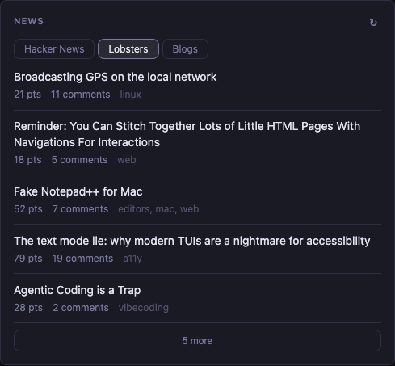

### Example

```yaml
- type: lobsters
  title: Lobsters
  limit: 10
  sort-by: hot
  cache: 30m
```

### Options

| Option | Type | Default | Description |
|--------|------|---------|-------------|
| `limit` | int | `25` | Maximum number of stories to display |
| `sort-by` | string | `hot` | Feed to use. `hot` for hottest stories; `new` or `newest` for the newest stories |

### Notes

- Uses the public Lobste.rs JSON API — no API key required.
- Tags are shown in muted text next to each item's metadata.

---

## Reddit

**Type:** `reddit`

Shows posts from a subreddit. Each item links to the article (or Reddit post for self-posts); metadata includes score, comment count, and author.

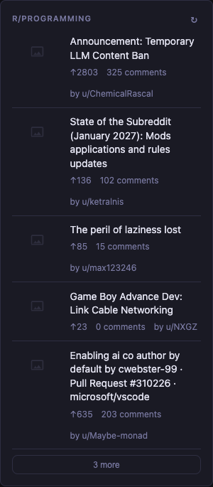

### Example

```yaml
- type: reddit
  title: r/selfhosted
  subreddit: selfhosted
  limit: 10
  sort-by: hot
  async-policy: stale
```

### Options

| Option | Type | Default | Description |
|--------|------|---------|-------------|
| `subreddit` | string | — | Subreddit name without the `r/` prefix (required) |
| `limit` | int | `15` | Number of posts to fetch and display |
| `sort-by` | string | `hot` | Feed sort. Any valid Reddit sort: `hot`, `new`, `top`, `rising` |
| `show-thumbnails` | bool | `true` | Show post preview images when available. Set to `false` to disable |

### Notes

- Uses Reddit's public JSON API (`/r/{subreddit}/{sort}.json`). No API key required.
- Thumbnails are only shown for link posts; self-posts never show a thumbnail.
- Reddit rate-limits unauthenticated requests. Use a reasonable `cache` duration (e.g. `30m`) to avoid hitting limits.

---

## Videos

**Type:** `videos`

Shows the latest videos from one or more YouTube channels, sorted by upload date. Videos can be added to the built-in floating player queue without leaving the page.

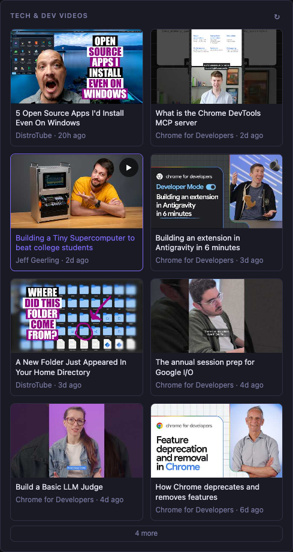

### Example

```yaml
- type: videos
  title: Tech Videos
  cache: 1h
  limit: 12
  async-policy: stale
  channels:
    - UCR-DXc1voovS8nhAvccRZhg   # Jeff Geerling
    - UCVls1GmFKf6WlTraIb_IaJg   # DistroTube
    - UCnUYZLuoy1rq1aVMwx4aTzw   # Fireship
```

### Options

| Option | Type | Default | Description |
|--------|------|---------|-------------|
| `channels` | list | — | List of YouTube channel IDs (required) |
| `limit` | int | `20` | Maximum number of videos to display across all channels |

### Finding a Channel ID

Channel IDs start with `UC` and are 24 characters long. You can find them in the channel's URL on YouTube, or by inspecting the page source. Comments in the config file are a good place to note the channel name alongside each ID.

### Notes

- Uses YouTube's public RSS feed (`/feeds/videos.xml?channel_id=...`) — no API key required.
- All channels are fetched in parallel and merged by upload date before the `limit` is applied.
- Clicking the play button overlay adds the video to the floating queue (YouTube embed player).
- Errors fetching individual channels are silently ignored; other channels still render.

---

## Bookmarks

**Type:** `bookmarks`

Displays groups of labelled links. Each link can optionally show an icon from the [Simple Icons](https://simpleicons.org/) library.

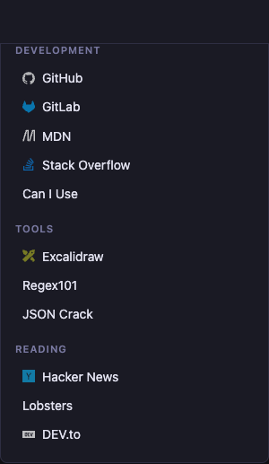

### Example

```yaml
- type: bookmarks
  title: Links
  groups:
    - name: Development
      links:
        - name: GitHub
          url: https://github.com
          icon: github
        - name: Stack Overflow
          url: https://stackoverflow.com
          icon: stackoverflow

    - name: Media
      links:
        - name: YouTube
          url: https://youtube.com
          icon: youtube
```

### Options

| Option | Type | Description |
|--------|------|-------------|
| `groups` | list | List of bookmark groups (required) |
| `groups[].name` | string | Group heading label |
| `groups[].links` | list | Links in this group |
| `groups[].links[].name` | string | Display label for the link |
| `groups[].links[].url` | string | URL to open (opens in new tab) |
| `groups[].links[].icon` | string | Simple Icons slug (optional). Find slugs at [simpleicons.org](https://simpleicons.org/) |

### Finding Icon Slugs

Icon slugs are the lowercase, kebab-case version of the service name as listed on Simple Icons. Examples:

| Service | Slug |
|---------|------|
| GitHub | `github` |
| Grafana | `grafana` |
| Audiobookshelf | `audiobookshelf` |
| Traefik Proxy | `traefikproxy` |
| Paperless-ngx | `paperlessngx` |

### Notes

- Groups with no `name` skip the heading entirely.
- All links open in a new tab with `rel="noopener noreferrer"`.
- The `cache` and `async-policy` options have no effect since bookmarks are static config.

---

## Search

**Type:** `search`

A search box that submits to a configurable search engine. Supports **bang shortcuts** — type a shortcut prefix to redirect the query to a different URL.

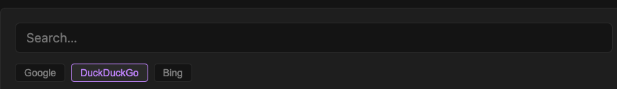

### Example

```yaml
- type: search
  hide-header: true
  engines:
    - name: Google
      url: https://www.google.com/search
    - name: DuckDuckGo
      url: https://duckduckgo.com/
  default-engine: Google
  autofocus: true
  placeholder: Search…
  bangs:
    - title: YouTube
      shortcut: "!yt"
      url: https://www.youtube.com/results?search_query={QUERY}
    - title: GitHub
      shortcut: "!gh"
      url: https://github.com/search?q={QUERY}
    - title: Wikipedia
      shortcut: "!w"
      url: https://en.wikipedia.org/wiki/Special:Search?search={QUERY}
```

### Options

| Option | Type | Default | Description |
|--------|------|---------|-------------|
| `engines` | list | — | List of search engines (required to show engine toggles) |
| `engines[].name` | string | — | Display label for the engine button |
| `engines[].url` | string | — | Search URL. Use `{QUERY}` for template engines, or a plain URL for native form submission |
| `default-engine` | string | first engine | Which engine is active by default |
| `search-engine` | string | — | **Deprecated.** Single engine URL; use `engines` instead |
| `autofocus` | bool | `false` | Focus the input automatically on page load |
| `placeholder` | string | `Search…` | Placeholder text shown inside the input |
| `bangs` | list | — | List of bang shortcut definitions (not displayed in UI) |
| `bangs[].title` | string | — | Label for reference |
| `bangs[].shortcut` | string | — | Prefix that triggers this bang (e.g. `!yt`) |
| `bangs[].url` | string | — | URL pattern. Use `{QUERY}` where the search term should be inserted |

### Bang Usage

Bangs are triggered by prefixing the query in the search box:

- `!yt lofi beats` → opens YouTube search for "lofi beats"
- `!gh dart shelf` → opens GitHub search for "dart shelf"
- `!yt` (alone, no query) → opens the bare bang URL with an empty query

### Engine URLs

There are two types of engine URLs:

**Template URLs** (contain `{QUERY}`) — intercepted client-side by AlpineJS:
- `http://searxng.example.com/search?q={QUERY}`
- `https://kagi.com/search?q={QUERY}`

**Plain URLs** — submitted as a normal HTML form:
- `https://www.google.com/search`
- `https://duckduckgo.com/`
- `https://www.bing.com/search`

When multiple engines are configured, toggle buttons appear below the search box. Clicking a button re-renders the widget server-side via HTMX while preserving any text typed in the input.

### Notes

- The search form opens results in a new tab.
- `hide-header: true` is common for the search widget to save vertical space.
- The `cache` option has no effect — this widget renders purely from config.
- If no `engines` or `search-engine` is configured, the widget shows "No search engines configured".

---

## Monitor

**Type:** `monitor`

Checks the HTTP reachability of a list of URLs and shows their status, HTTP response code, and response time. Includes filter tabs for All / Up / Failing.

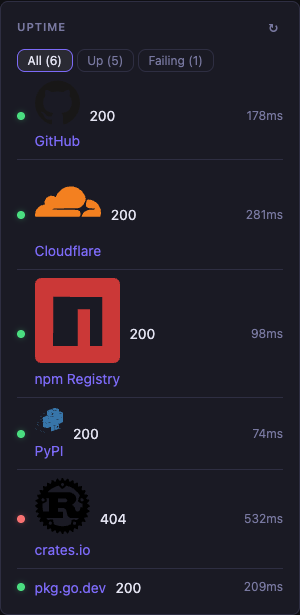 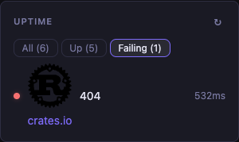 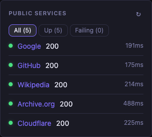

### Example

```yaml
- type: monitor
  title: Services Status
  cache: 5m
  async-policy: stale
  sites:
    - title: GitHub
      url: https://github.com
      icon: github
    - title: Grafana
      url: http://grafana.home.local
      icon: grafana
    - title: Paperless
      url: http://paperless.home.local
      icon: paperlessngx
```

### Options

| Option | Type | Default | Description |
|--------|------|---------|-------------|
| `sites` | list | — | List of sites to monitor (required) |
| `sites[].title` | string | — | Display label for the site |
| `sites[].url` | string | — | URL to probe with an HTTP GET request |
| `sites[].icon` | string | — | Simple Icons slug (optional) |
| `style` | string | `normal` | `normal` shows icons; `compact` hides them |

### Status Display

Each row shows:
- A coloured dot (green = up, red = down)
- The site title as a link
- HTTP status code (`200`, `404`, etc.) or `—` on timeout
- Response time in milliseconds, or `timeout`

### Notes

- A site is considered **up** when it returns any HTTP response (including 4xx/5xx) within the timeout. **Down** means a connection error or timeout.
- Use a reasonable `cache` duration. Very short intervals (e.g. `30s`) will result in frequent outbound probes.
- Icons are only shown in `normal` style (the default).

---

## Markets

**Type:** `markets`

Displays stock and cryptocurrency prices with an intraday sparkline chart. Data is fetched from the Yahoo Finance API — no API key required.

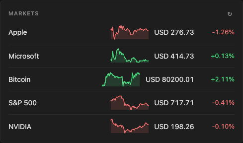

### Example

```yaml
- type: markets
  hide-header: true
  cache: 5m
  async-policy: stale
  markets:
    - symbol: SPY
      name: S&P 500
    - symbol: BTC-USD
      name: Bitcoin
    - symbol: NVDA
      name: NVIDIA
    - symbol: AAPL
      name: Apple
```

### Options

| Option | Type | Default | Description |
|--------|------|---------|-------------|
| `markets` | list | — | List of symbols to display (required) |
| `markets[].symbol` | string | — | Yahoo Finance ticker symbol (e.g. `AAPL`, `BTC-USD`, `^GSPC`) |
| `markets[].name` | string | symbol | Display label. Defaults to the symbol if omitted |
| `sort-by` | string | — | Optional sort: `name`, `change` (% change desc), or `absolute-change` (absolute change desc). Omit to preserve config order |

### Symbol Formats

| Asset type | Example symbols |
|-----------|-----------------|
| US stocks | `AAPL`, `MSFT`, `NVDA`, `TSLA` |
| ETFs | `SPY`, `QQQ`, `VTI` |
| Crypto | `BTC-USD`, `ETH-USD`, `SOL-USD` |
| Indices | `^GSPC` (S&P 500), `^DJI` (Dow), `^IXIC` (NASDAQ) |
| Forex | `EURUSD=X`, `GBPUSD=X` |

### Notes

- The sparkline shows today's intraday price movement in green (up) or red (down).
- Price is prefixed with the ISO 4217 currency code returned by Yahoo Finance (e.g. `USD 198.45`, `EUR 1.23`).
- Price change is calculated as `current − previous close`.
- All symbols are fetched in parallel; fetch errors for individual symbols are silently ignored.
- Markets data is time-sensitive — a `cache` of `5m` is a reasonable default.

---

## Releases

**Type:** `releases`

Shows the latest releases from GitHub, GitLab, Codeberg, and Docker Hub repositories, merged and sorted by date.

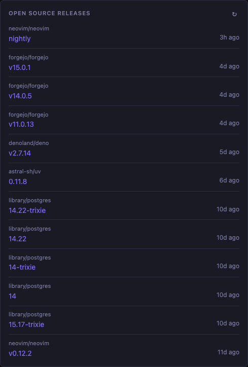

### Example

```yaml
- type: releases
  title: Open Source Releases
  cache: 6h
  limit: 12
  async-policy: stale
  repositories:
    - grafana/grafana              # GitHub (default)
    - github:golang/go             # GitHub (explicit)
    - gitlab:inkscape/inkscape     # GitLab
    - codeberg:readeck/readeck     # Codeberg
    - dockerhub:library/postgres   # Docker Hub tags
```

### Options

| Option | Type | Default | Description |
|--------|------|---------|-------------|
| `repositories` | list | — | List of repository references (required) |
| `limit` | int | `10` | Maximum number of releases to show across all repos |

### Repository Formats

| Format | Example | Source |
|--------|---------|--------|
| `owner/repo` | `grafana/grafana` | GitHub (implicit) |
| `github:owner/repo` | `github:grafana/grafana` | GitHub (explicit) |
| `gitlab:owner/repo` | `gitlab:inkscape/inkscape` | GitLab.com |
| `codeberg:owner/repo` | `codeberg:readeck/readeck` | Codeberg.org |
| `dockerhub:namespace/image` | `dockerhub:library/postgres` | Docker Hub tags |

### Notes

- Releases from all repositories are fetched in parallel, merged, and sorted by date before `limit` is applied.
- Up to 5 releases per repository are fetched.
- For Docker Hub, "releases" are image tags sorted by last push date.
- GitHub and GitLab use their public REST APIs (public repos only; unauthenticated rate limits apply). Use a long `cache` duration (e.g. `6h`).

---

## Repository

**Type:** `repository`

Shows an overview of a GitHub repository: stars, forks, open issue count, description, and recent pull requests, issues, and commits.

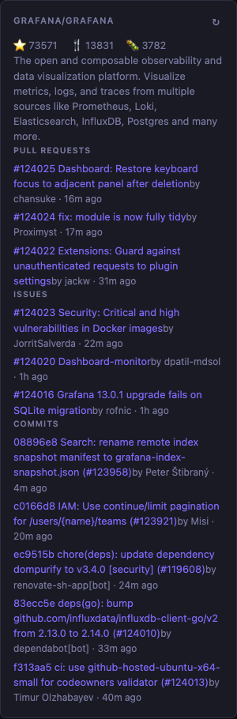

### Example

```yaml
- type: repository
  title: grafana/grafana
  cache: 30m
  async-policy: stale
  repository: grafana/grafana
  pull-requests-limit: 3
  issues-limit: 3
  commits-limit: 5
```

### Options

| Option | Type | Default | Description |
|--------|------|---------|-------------|
| `repository` | string | — | GitHub repository in `owner/repo` format (required) |
| `pull-requests-limit` | int | `3` | Number of open pull requests to show |
| `issues-limit` | int | `3` | Number of open issues to show |
| `commits-limit` | int | `5` | Number of recent commits to show |

### Display

The widget shows:
- **Stats bar** — stars (⭐), forks (🍴), open issue count (🐛)
- **Description** — repository description from GitHub
- **Pull Requests** — open PRs with number, title, author, and age
- **Issues** — open issues (pull requests filtered out) with number, title, author, and age
- **Commits** — recent commits with short SHA, message (first line), author, and age

### Notes

- Uses the public GitHub REST API. No API token is configured, so only public repositories are accessible and the unauthenticated rate limit (60 req/h) applies.
- All four API calls are made in parallel and cached together.

---

## Audiobookshelf

**Type:** `audiobookshelf`

Integrates with an [Audiobookshelf](https://www.audiobookshelf.org/) instance to show in-progress books, podcast episodes, recently added items, and more. Items can be added directly to the built-in audio player queue.

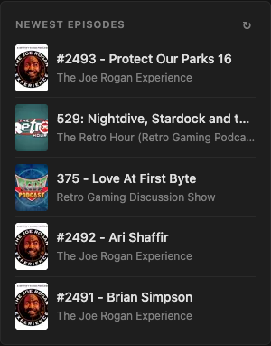

### Example

```yaml
- type: audiobookshelf
  title: Continue Listening
  cache: 10m
  async-policy: stale
  url: http://audiobookshelf.home.local
  api-key: YOUR_API_KEY_HERE
  mode: continue
  limit: 5
```

### Options

| Option | Type | Default | Description |
|--------|------|---------|-------------|
| `url` | string | — | Base URL of your Audiobookshelf instance (required) |
| `api-key` | string | — | API key from Audiobookshelf settings (required) |
| `mode` | string | `newest` | What to display — see modes below |
| `limit` | int | `10` | Maximum number of items to show |
| `library` | string | — | Library name. Required for modes that use the personalized endpoint |

### Modes

| Mode | Description | Requires `library` |
|------|-------------|:------------------:|
| `continue` or `continue-listening` | Items currently in progress | No |
| `newest` | Most recently added items across all libraries | No |
| `continue-series` | Next book in series you have started | Yes |
| `listen-again` | Items you have finished | Yes |
| `recently-added` | Recently added items in a specific library | Yes |
| `newest-episodes` | Newest podcast episodes in a specific library | Yes |

### Getting an API Key

1. Open your Audiobookshelf instance
2. Go to **Settings → Users** → click your user
3. Under **API Keys**, create a new key and copy it

### Notes

- Items display cover art, title, subtitle, and a progress bar for in-progress media.
- The play button adds the item's stream URL to the floating audio player queue.
- The `library` option must match the **library name** exactly as shown in Audiobookshelf.

---

## API

**Type:** `api`

Fetches data from any JSON API and renders it using a [Mustache](https://mustache.github.io/) template. Supports multiple routes with path parameters, custom headers, request bodies, and scoped CSS styling. Perfect for embedding data from custom services or public APIs that don't have a dedicated widget.

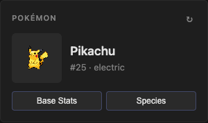 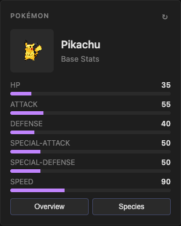 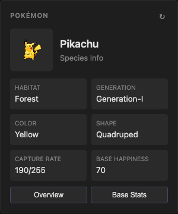

### Single Route

The simplest setup defines one route that fetches a URL and renders it with a template:

```yaml
- type: api
  title: GitHub User
  cache: 30m
  routes:
    - path: _default
      url: https://api.github.com/users/octocat
      template: |
        <div style="text-align:center">
          
          <h3>{{login}}</h3>
          <p>{{bio}}</p>
          <p>Public repos: {{public_repos}} | Followers: {{followers}}</p>
        </div>
```

The first route in the list serves as the default view when no sub-path is visited. Sub-routes are accessed via URLs like `/widget/<id>/<path>`.

### Multiple Routes

Define multiple routes to create a multi-view widget. Each route has its own URL, method, template, and optional headers/body. The first route is the default view. Path parameters use `<name>` syntax and are interpolated into URLs and bodies with `{name}`. Templates support [Mustache filters](#string-filters) and [block helpers](#block-helpers).

```yaml
- type: api
  title: Pokémon
  cache: 1h
  style: |
    .card-header { display:flex; gap:12px; align-items:center; margin-bottom:12px; }
    .sprite { width:72px; height:72px; image-rendering:pixelated; background:#2a2a2a; border-radius:6px; }
    .title { font-size:1.1rem; font-weight:600; text-transform:capitalize; color:#e0e0e0; }
    .subtitle { font-size:0.8rem; color:#808080; }
    .btn-row { display:flex; gap:6px; margin-top:10px; }
    .btn { flex:1; background:#2a2a2a; border:1px solid #414868; border-radius:4px; padding:6px 0; color:#e0e0e0; font-size:0.75rem; cursor:pointer; }
    .btn:hover { border-color:#c084fc; }
    .stat-row { margin-bottom:6px; }
    .stat-label { display:flex; justify-content:space-between; font-size:0.75rem; margin-bottom:2px; }
    .stat-name { text-transform:uppercase; color:#808080; }
    .stat-value { font-weight:600; color:#e0e0e0; }
    .bar-track { background:#2a2a2a; border-radius:3px; height:6px; overflow:hidden; }
    .bar-fill { background:#c084fc; height:100%; }
    .bar-fill--high { background:#f0c040; }
    .info-grid { display:grid; grid-template-columns:1fr 1fr; gap:8px; }
    .info-cell { background:#2a2a2a; padding:8px; border-radius:4px; }
    .info-label { font-size:0.65rem; text-transform:uppercase; color:#808080; }
    .info-value { font-size:0.85rem; color:#e0e0e0; }
    .catch-easy { color:#4ade80; font-size:0.75rem; }
    .catch-hard { color:#f87171; font-size:0.75rem; }
  routes:
    - path: overview
      url: https://pokeapi.co/api/v2/pokemon/pikachu
      method: GET
      template: |
        <div class="card-header">
          
          <div>
            <div class="title">{{name | capitalize}}</div>
            <div class="subtitle">#{{id}} · {{#types}}{{type.name | capitalize}} {{/types}}</div>
          </div>
        </div>
        <div class="btn-row">
          <button hx-get="stats" hx-target="closest .widget" hx-swap="outerHTML" class="btn">Base Stats</button>
          <button hx-get="species" hx-target="closest .widget" hx-swap="outerHTML" class="btn">Species</button>
        </div>
    - path: stats
      url: https://pokeapi.co/api/v2/pokemon/pikachu
      method: GET
      template: |
        <div class="card-header">
          
          <div>
            <div class="title">{{name | capitalize}}</div>
            <div class="subtitle">Base Stats</div>
          </div>
        </div>
        {{#each stats}}
        <div class="stat-row">
          <div class="stat-label">
            <span class="stat-name">{{stat.name | capitalize}}</span>
            <span class="stat-value">{{base_stat}}/255</span>
          </div>
          <div class="bar-track">
            <div class="bar-fill{{#if base_stat > 100}} bar-fill--high{{/if}}" style="width:{{base_stat}}px;max-width:100%"></div>
          </div>
        </div>
        {{/each}}
        <div class="btn-row">
          <button hx-get="overview" hx-target="closest .widget" hx-swap="outerHTML" class="btn">Overview</button>
        </div>
    - path: species
      url: https://pokeapi.co/api/v2/pokemon-species/25
      method: GET
      template: |
        <div class="card-header">
          
          <div>
            <div class="title">Pikachu</div>
            <div class="subtitle">Species Info</div>
          </div>
        </div>
        <div class="info-grid">
          <div class="info-cell">
            <div class="info-label">Habitat</div>
            <div class="info-value">{{habitat.name | capitalize | default("Unknown")}}</div>
          </div>
          <div class="info-cell">
            <div class="info-label">Generation</div>
            <div class="info-value">{{generation.name | uppercase}}</div>
          </div>
          <div class="info-cell">
            <div class="info-label">Color</div>
            <div class="info-value">{{color.name | capitalize}}</div>
          </div>
          <div class="info-cell">
            <div class="info-label">Shape</div>
            <div class="info-value">{{shape.name | capitalize}}</div>
          </div>
          <div class="info-cell">
            <div class="info-label">Capture Rate</div>
            <div class="info-value">{{capture_rate}}/255
              {{#if capture_rate > 200}}<span class="catch-easy">Easy</span>{{/if}}
              {{#if capture_rate <= 45}}<span class="catch-hard">Hard</span>{{/if}}</div>
          </div>
          <div class="info-cell">
            <div class="info-label">Base Happiness</div>
            <div class="info-value">{{#if base_happiness}}{{base_happiness}}{{/if}}{{#unless base_happiness}}N/A{{/unless}}</div>
          </div>
        </div>
        <div class="btn-row">
          <button hx-get="overview" hx-target="closest .widget" hx-swap="outerHTML" class="btn">Overview</button>
        </div>
```

### Helpers & Filters Example

```yaml
- type: api
  title: Server Status
  cache: 5m
  routes:
    - path: _default
      url: https://api.example.com/status
      template: |
        {{#if error}}
          <div class="error">{{error.status}}: {{error.message}}</div>
        {{/if}}
        {{#unless error}}
          <div class="status">
            <div class="name">{{name | uppercase}}</div>
            <div class="version">v{{version}}</div>
            {{#if uptime}}
              <div class="uptime">Up for {{uptime}}s</div>
            {{/if}}
            {{#each services}}
              <div class="service {{#if healthy}}ok{{/if}}{{#unless healthy}}fail{{/unless}}">
                {{name}} — {{#if healthy}}healthy{{/if}}{{#unless healthy}}down{{/unless}}
              </div>
            {{/each}}
          </div>
        {{/unless}}
```

### Conditional Examples

#### Show different content based on status

```yaml
- type: api
  title: Build Status
  cache: 5m
  routes:
    - path: _default
      url: https://ci.example.com/builds/latest
      template: |
        {{#if status == "success"}}
          <span style="color:#4ade80">Build passed</span>
        {{/if}}
        {{#if status == "failed"}}
          <span style="color:#f87171">Build failed</span>
        {{/if}}
        {{#if status != "success" && status != "failed"}}
          <span style="color:#fbbf24">Build {{status}}</span>
        {{/if}}
```

#### Numeric comparison

```yaml
- type: api
  title: Disk Usage
  cache: 10m
  routes:
    - path: _default
      url: https://monitoring.example.com/disk
      template: |
        <div>Disk: {{used}} / {{total}} GB</div>
        {{#if percent > 90}}
          <div style="color:#f87171;font-weight:600">Critical — {{percent}}% used</div>
        {{/if}}
        {{#if percent > 70 && percent <= 90}}
          <div style="color:#fbbf24">Warning — {{percent}}% used</div>
        {{/if}}
        {{#if percent <= 70}}
          <div style="color:#4ade80">OK — {{percent}}% used</div>
        {{/if}}
```

#### List iteration

```yaml
- type: api
  title: Pull Requests
  cache: 15m
  routes:
    - path: _default
      url: https://api.github.com/repos/octocat/Hello-World/pulls
      template: |
        <h4>Open PRs</h4>
        {{#each .}}
          <div class="pr {{#if draft}}draft{{/if}}">
            <a href="{{html_url}}">#{{number}}</a>
            {{title | truncate(60)}}
            <span>{{user.login}}</span>
          </div>
        {{/each}}
```

Or use `{{#unless ...}}` to show an empty state:

```yaml
- type: api
  title: Pull Requests
  cache: 15m
  routes:
    - path: _default
      url: https://api.example.com/pulls
      template: |
        <h4>Open PRs</h4>
        {{#unless .}}
          <div style="color:#808080">No open pull requests</div>
        {{/unless}}
        {{#each .}}
          <div class="pr">
            <a href="{{url}}">#{{number}}</a> {{title}}
          </div>
        {{/each}}
```

#### Filters with fallbacks

```yaml
- type: api
  title: Weather
  cache: 30m
  routes:
    - path: _default
      url: https://api.weather.example.com/current
      template: |
        <div class="weather">
          <div class="city">{{city | default("Local")}}</div>
          <div class="temp">{{temp | default(0)}}°C</div>
          <div class="desc">{{description | capitalize | default("Unknown")}}</div>
        </div>
```

#### Unless — show banner when NOT present

```yaml
- type: api
  title: Notifications
  cache: 1m
  routes:
    - path: _default
      url: https://api.example.com/notifications
      template: |
        {{#unless read}}
          <div class="badge">{{count}} unread</div>
        {{/unless}}
        {{#each notifications}}
          <div class="note {{#if unread}}unread{{/if}}">
            {{title | truncate(50)}}
          </div>
        {{/each}}
```

### Options

| Option | Type | Default | Description |
|--------|------|---------|-------------|
| `style` | string | — | Scoped CSS applied only to this widget instance |
| `routes` | list | — | **Required.** List of routes. The first route is the default view when no sub-path is visited |
| `routes[].path` | string | — | Route path pattern. Use `<param>` for capture groups |
| `routes[].url` | string | — | **Required.** URL for this route. `{param}` placeholders are replaced with path/query values |
| `routes[].method` | string | `GET` | HTTP method for this route. `GET`, `POST`, `PUT`, `PATCH`, or `DELETE` |
| `routes[].headers` | map | — | Custom HTTP headers sent with this route |
| `routes[].body` | map | — | JSON request body (for `POST`/`PUT`/`PATCH`). Supports `{param}` interpolation |
| `routes[].template` | string | — | **Required.** Mustache template for rendering this route's response |

### Template Syntax

The widget uses an extended Mustache engine that supports block helpers (conditions & iteration) and inline filters (value transformation).

#### Variables

| Syntax | Meaning |
|--------|---------|
| `{{name}}` | Insert variable (HTML-escaped) |
| `{{{name}}}` | Insert variable (raw HTML) |
| `{{a.b.c}}` | Dotted names for nested objects |

#### Block Helpers

| Syntax | Meaning |
|--------|---------|
| `{{#if x}} … {{/if}}` | Show block when `x` is truthy |
| `{{#if a == b}} … {{/if}}` | Show block when `a == b` (loose equality) |
| `{{#if score > 50}} … {{/if}}` | Show block when `score > 50` (numeric) |
| `{{#if a && b}} … {{/if}}` | Show block when both `a` and `b` are truthy |
| `{{#unless x}} … {{/unless}}` | Show block only when `x` is falsy |
| `{{#each list}} … {{/each}}` | Iterate a list with `@index`, `@first`, `@last` |
| `{{#let name value}} … {{/let}}` | Bind a local variable inside the block |

**Expressions in `if`** support: `==`, `!=`, `<`, `>`, `<=`, `>=`, `&&`, `||`, `+`, `-`, `*`, `/`, `()` grouping, string concatenation, and unary `-`.

**Truthy values:** non-empty strings, non-zero numbers, `true`, non-empty lists/maps.
**Falsy values:** `null`, `false`, `0`, empty strings `""`, empty lists `[]`, empty maps `{}`.

#### Inline Filters

Pipe a variable through one or more filters. Filter args use parentheses:

| Syntax | Meaning |
|--------|---------|
| `{{name \| uppercase}}` | Convert to uppercase |
| `{{name \| lowercase}}` | Convert to lowercase |
| `{{name \| capitalize}}` | Capitalise first letter |
| `{{text \| truncate(50)}}` | Truncate to 50 chars |
| `{{name \| default("N/A")}}` | Use `"N/A"` when value is empty/null |

Filters can be chained: `{{bio \| lowercase \| truncate(100)}}`

#### String Filters

| Filter | Args | Description |
|--------|------|-------------|
| `uppercase` | — | Convert to UPPERCASE |
| `lowercase` | — | Convert to lowercase |
| `capitalize` | — | Capitalize first letter |
| `trim` | — | Remove leading/trailing whitespace |
| `truncate` | `length` | Truncate to N characters |
| `default` | `fallback` | Use fallback when value is null/empty |
| `replace` | `search`, `replacement` | Replace all occurrences |
| `slice` | `start`, `end?` | Substring with optional end index |
| `strip_html` | — | Remove HTML tags and decode entities |
| `url_encode` | — | URL-encode a string |

#### Number Filters

| Filter | Args | Description |
|--------|------|-------------|
| `round` | `decimals?` | Round to N decimal places |
| `number` | — | Format with thousands separator (1,234,567) |
| `filesize` | — | Human-readable file size (KB, MB, GB…) |
| `abs` | — | Absolute value |

#### List Filters

| Filter | Args | Description |
|--------|------|-------------|
| `split` | `delimiter` | Split string into list |
| `join` | `delimiter` | Join list into string |
| `size` | — | Length of list, string, or map |
| `first` | — | First element or character |
| `last` | — | Last element or character |
| `at` | `index` | Element at index (negative from end) |
| `take` | `count` | First N elements or characters |

#### Standard Mustache

Regular Mustache sections still work exactly as before:

| Syntax | Meaning |
|--------|---------|
| `{{#list}} … {{/list}}` | Loop over a list / truthy section |
| `{{^empty}} … {{/empty}}` | Inverted section (falsy/empty check) |

### Error Handling

When the API returns a status >= 400, an `error` object is injected into the template context:

```json
{
  "error": {
    "status": 404,
    "message": "..."
  }
}
```

Use `{{#error}}` in your template to render error states gracefully. If the template does not reference `error`, the widget throws an exception and shows the standard error panel.

### Scoped CSS

The `style` option is automatically scoped to the widget instance using `scopeCss`. All selectors are prefixed with a unique class (e.g. `.aw-api-5`), so styles never leak to other widgets. The scoping supports:

- Complex selectors including `:is()`, `:where()`, `:not()`, `:has()`
- Multi-line selectors and comma-separated lists
- `@media`, `@supports`, and `@layer` blocks (nested rules are scoped too)
- Strings and comments inside CSS

### HTMX Integration

Each API widget wrapper includes `data-hx-base="/widget/{id}/"`, so HTMX requests from inside the template are automatically routed to the widget's own routes. Use `hx-get="route-name"` (without a leading `/`) to navigate between views without full page reloads.

### Notes

- Responses must be valid JSON. Non-JSON responses throw a `FormatException`.
- Route-level `url` and `template` override widget-level values.
- Path variables and query parameters are merged for interpolation; query parameters take precedence on key collisions.
- Each unique route + parameter combination is cached independently.

---

## Docker

**Type:** `docker`

Lists Docker (or Podman) containers and allows starting, stopping, and restarting them directly from Hyper Dashboard. Clicking a container opens a detail view with logs and inspect information.

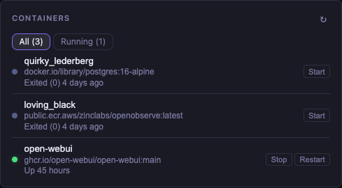 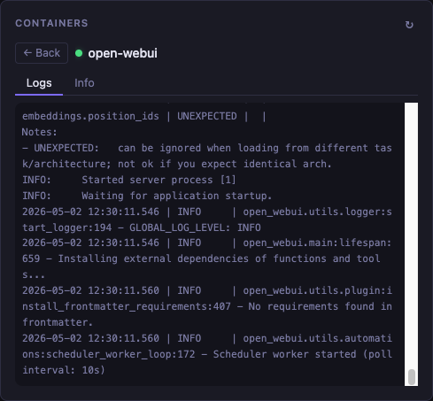 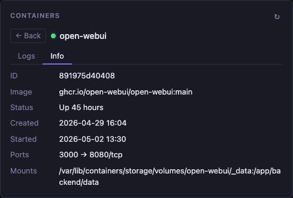

### Example

```yaml
- type: docker
  title: Containers
  cache: 10s
  options:
    socket: unix:///var/run/docker.sock
    limit: 20
```

### Options

| Option | Type | Default | Description |
|--------|------|---------|-------------|
| `socket` | string | `unix:///var/run/docker.sock` | Docker socket path |
| `limit` | int | `20` | Maximum number of containers to show |

### Podman

Podman exposes a Docker-compatible socket. Find its path with:

```bash
podman info --format '{{.Host.RemoteSocket.Path}}'
```

### Container Detail View

Clicking any container opens a detail panel with two tabs:

- **Logs** — last 200 log lines, auto-scrolled to the bottom
- **Info** — container ID, image, status, created/started timestamps, port bindings, and mounts

### Actions

| Container state | Available actions |
|-----------------|------------------|
| Running | Stop, Restart |
| Stopped / Exited | Start |

### Notes

- The Docker socket must be accessible to the Hyper Dashboard process. When running in Docker, mount the socket as a volume (see [building.md](building.md)).
- Container data is cached for the `cache` duration — a short value (e.g. `10s`) gives near-live status.

---

## Twitch Channels

**Type:** `twitch-channels`

Shows the live/offline status of a list of Twitch channels. Live channels appear first with viewer count and current game; offline channels are shown below with reduced styling.

> **Note:** Requires a Twitch application Client ID and Secret. See [Getting Twitch API Credentials](#getting-twitch-api-credentials) below.

### Example

```yaml
- type: twitch-channels
  title: Live Channels
  cache: 5m
  async-policy: stale
  client-id: YOUR_CLIENT_ID
  client-secret: YOUR_CLIENT_SECRET
  channels:
    - shroud
    - timthetatman
    - summit1g
  collapse-after: 5
```

### Options

| Option | Type | Default | Description |
|--------|------|---------|-------------|
| `client-id` | string | — | Twitch application Client ID (required) |
| `client-secret` | string | — | Twitch application Client Secret (required) |
| `channels` | list | — | List of Twitch login names (lowercase) to follow (required) |
| `collapse-after` | int | all channels | Show this many channels initially; the rest collapse behind a "Show N more" button |

### Notes

- Channel names in `channels` should be the login name (lowercase), not the display name.
- Live channels are automatically sorted to the top regardless of their position in the config list.

---

## Twitch Top Games

**Type:** `twitch-top-games`

Shows the currently most-watched games on Twitch, ranked by viewer count, with box art.

> **Note:** Requires a Twitch application Client ID and Secret. See [Getting Twitch API Credentials](#getting-twitch-api-credentials) below.

### Example

```yaml
- type: twitch-top-games
  title: Trending on Twitch
  cache: 10m
  async-policy: stale
  client-id: YOUR_CLIENT_ID
  client-secret: YOUR_CLIENT_SECRET
  limit: 10
  exclude:
    - Just Chatting
    - Special Events
```

### Options

| Option | Type | Default | Description |
|--------|------|---------|-------------|
| `client-id` | string | — | Twitch application Client ID (required) |
| `client-secret` | string | — | Twitch application Client Secret (required) |
| `limit` | int | `10` | Number of games to display |
| `exclude` | list | — | Game names to hide (case-insensitive) |

### Getting Twitch API Credentials

1. Go to the [Twitch Developer Console](https://dev.twitch.tv/console/apps)
2. Click **Register Your Application**
3. Set the OAuth Redirect URL to `http://localhost`
4. Select **Application Integration** as the category
5. Copy the **Client ID** and generate a **Client Secret**

The same credentials work for both `twitch-channels` and `twitch-top-games`.

### Notes

- To ensure `limit` games remain after exclusions, the widget fetches `limit + len(exclude) + 10` entries from the API.

---

## HTML

**Type:** `html`

Renders arbitrary HTML directly into the widget body. Useful for embedding custom content, badges, or snippets that don't fit another widget type.

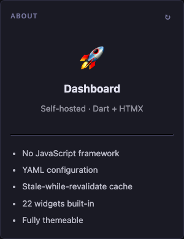

### Example

```yaml
- type: html
  title: About
  source: |
    <div style="text-align:center;padding:1rem 0">
      <div style="font-size:2.5rem">🚀</div>
      <h2 style="margin:.5rem 0">Dashboard</h2>
    </div>
    <ul>
      <li>Self-hosted</li>
      <li>No JavaScript framework</li>
    </ul>
```

### Options

| Option | Type | Description |
|--------|------|-------------|
| `source` | string | Raw HTML to render inside the widget (required) |

### Notes

- The HTML is inserted **without escaping** — it is your responsibility to ensure the content is safe.
- Inline styles and scripts within `source` will execute as normal browser HTML.
- CSS variables such as `var(--bg)`, `var(--text)`, `var(--accent)`, and `var(--border)` are available for theme-consistent styling.
- The `cache` option has no effect — this widget renders purely from config.

---

## iFrame

**Type:** `iframe`

Embeds an external URL inside the widget using an HTML `<iframe>`. Useful for embedding dashboards, status pages, or any web content.

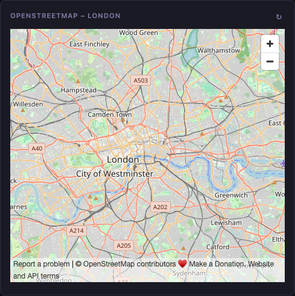

### Example

```yaml
- type: iframe
  title: OpenStreetMap
  source: https://www.openstreetmap.org/export/embed.html?bbox=-0.25,51.45,0.05,51.57&layer=mapnik
  height: 420
```

### Options

| Option | Type | Default | Description |
|--------|------|---------|-------------|
| `source` | string | — | URL to embed in the iframe (required) |
| `height` | int | `400` | Height of the iframe in pixels |

### Notes

- The iframe always stretches to 100% of the widget's width.
- Some sites block embedding via the `X-Frame-Options` or `Content-Security-Policy` headers. If the content doesn't appear, check your browser's developer console.
- For Grafana, append `?kiosk` to the Grafana dashboard URL to hide the Grafana toolbar.
- The `cache` option has no effect — the iframe src is rendered purely from config.

---

## Group

**Type:** `group`

Wraps multiple widgets into a tabbed container. Only one tab is visible at a time; clicking a tab switches the displayed widget. Useful for combining related content (e.g. different news feeds) without stacking them vertically.

 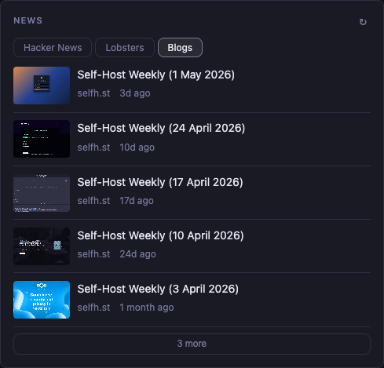

### Example

```yaml
- type: group
  title: News
  cache: 30m
  async-policy: stale
  widgets:
    - type: hacker-news
      title: Hacker News
      limit: 10

    - type: lobsters
      title: Lobsters
      limit: 10
      sort-by: hot

    - type: rss
      title: Blogs
      limit: 8
      feeds:
        - url: https://selfh.st/rss/
          name: selfh.st
```

### Options

| Option | Type | Description |
|--------|------|-------------|
| `widgets` | list | Child widget definitions. Each entry uses the same format as a top-level widget |

### Notes

- The **group's** `cache`, `refresh`, and `async-policy` settings are inherited by all child widgets. Child-level `cache` and `refresh` overrides are ignored.
- Tab labels come from each child widget's `title` (or its `defaultTitle` if no title is set).
- The first tab is active by default. Tab state is not persisted across page loads.
- Child widgets render all their content upfront; switching tabs is instant (no additional network requests).

---

## Split Column

**Type:** `split-column`

Renders multiple widgets side-by-side in a CSS grid. Works within a single column — handy for placing two feeds or two video lists next to each other inside a `full`-width column.

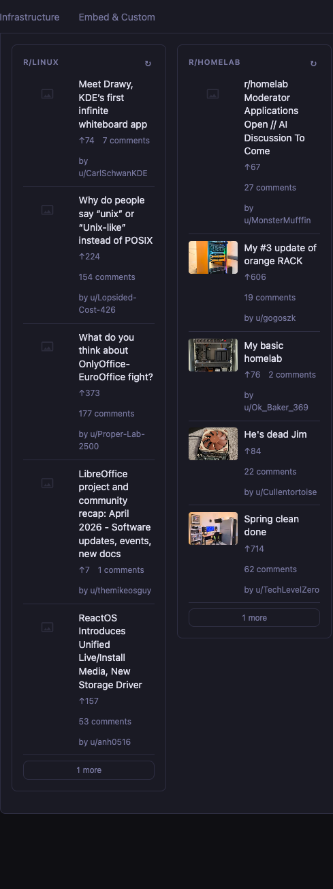

### Example

```yaml
- type: split-column
  max-columns: 2
  async-policy: stale
  widgets:
    - type: reddit
      title: r/technology
      subreddit: technology
      limit: 8
      sort-by: hot

    - type: reddit
      title: r/selfhosted
      subreddit: selfhosted
      limit: 8
      sort-by: hot
```

### Options

| Option | Type | Default | Description |
|--------|------|---------|-------------|
| `max-columns` | int | `2` | Maximum number of columns in the grid |
| `widgets` | list | — | Child widget definitions. Each entry uses the same format as a top-level widget |

### Notes

- Each child widget is rendered as a full standalone widget (with its own header and frame) inside its grid cell.
- The `cache`, `refresh`, and `async-policy` settings on the `split-column` itself are inherited by child widgets.
- Works best inside a `full`-size column where horizontal space is available.
